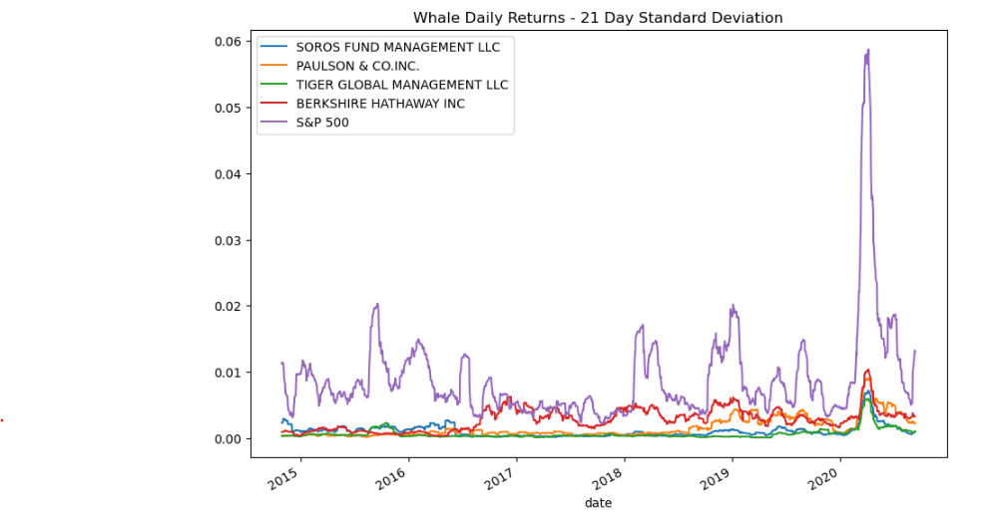
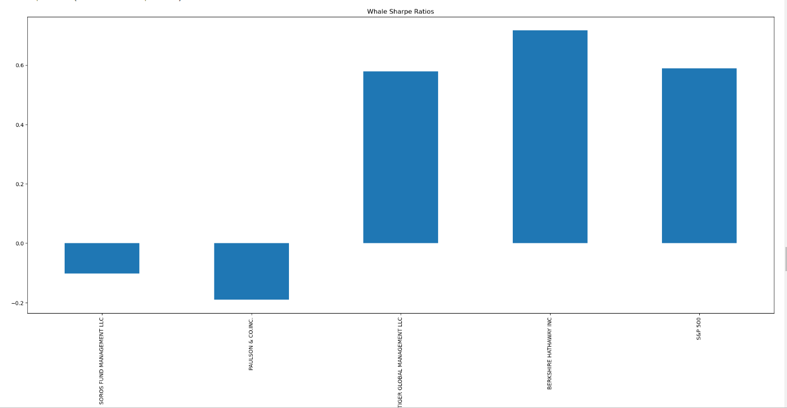
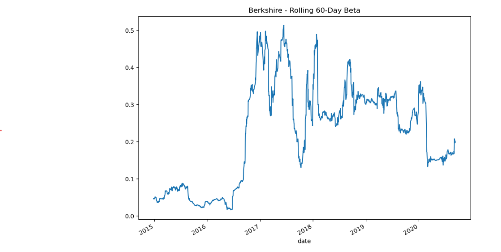

# Risk Return Analysis for Funds
In this project, I produce a Jupyter notebook that contains  data preparation, analysis, and visualizations for key risk and return metrics of four different funds and the S&P 500.

---

## Technologies
The project uses python 3.7 as a programming language and Jupyter Lab notebook. 

---

## Usage

This project aims to offer clients a one-stop online investment solution for their retirement portfolios that’s both inexpensive and high quality. This is done through quantative analyses using Sharpe Ratios, variance, covariance, and beta. Here is an example of the portfolio analyses visualized through using matplotlib:

---

## Contributors

Yasmin Sharbaf
Questions? Contact through linkedin:
[Yasmin Sharbaf Linkedin] (https://www.linkedin.com/in/yasmin-sharbaf)